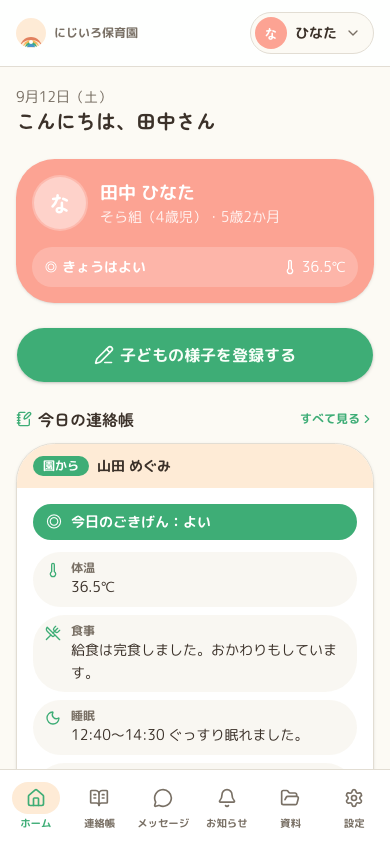
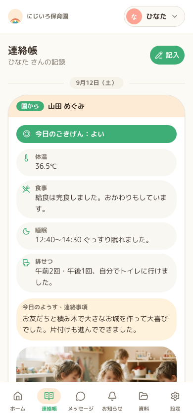
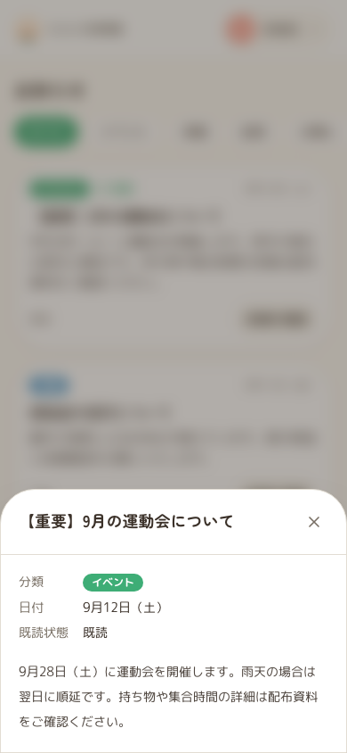
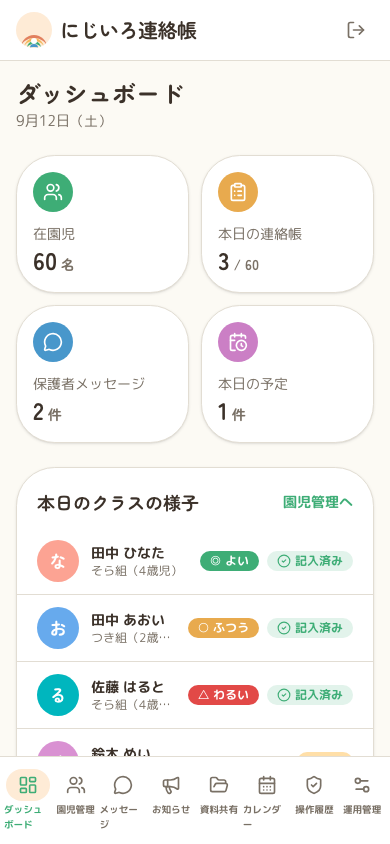
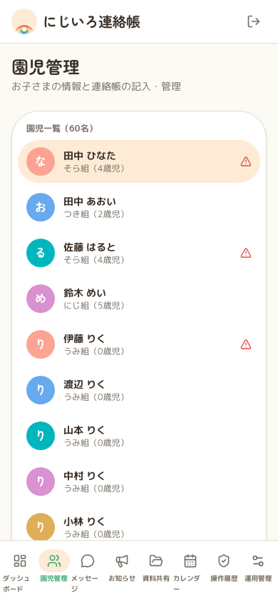
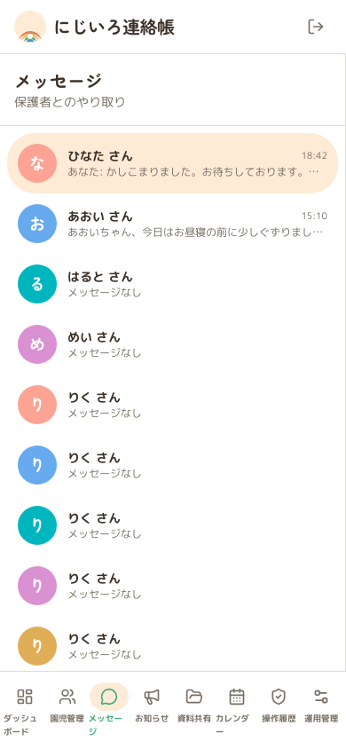

# にじいろ連絡帳

Next.js / React / TypeScript で作成した保育園向け連絡帳アプリです。
Node.js 24 LTS（22.12以上）、pnpm 10.28.1を使用します。

## アプリ画面

保護者は、子どもの様子や園からの連絡帳を確認・記入し、お知らせの詳細確認や園とのメッセージ交換ができます。

| ホーム                                                                              | 連絡帳                                                                                  | お知らせ詳細                                                                                       |
| ----------------------------------------------------------------------------------- | --------------------------------------------------------------------------------------- | -------------------------------------------------------------------------------------------------- |
|  |  |  |

保育士は、園全体の状況をダッシュボードで確認し、園児情報・連絡帳・保護者とのメッセージを管理できます。

| ダッシュボード                                                                                    | 園児管理                                                                                   | メッセージ                                                                                   |
| ------------------------------------------------------------------------------------------------- | ------------------------------------------------------------------------------------------ | -------------------------------------------------------------------------------------------- |
|  |  |  |

## エージェント用環境（Docker・認証サービス不要）

```sh
pnpm install --frozen-lockfile
pnpm dev:agent
```

[http://localhost:3000/parent](http://localhost:3000/parent) を開くと保護者として操作できます。
PGliteの初期化・マイグレーション・デモデータ投入は起動時に自動実行します。
`.env.local` やAPIキーは不要です。データは `.data/pglite/` に保存され、再起動後も残ります。

```sh
pnpm db:setup:agent  # DB初期化のみ（再実行可能）
pnpm db:check:agent  # SQLで疎通・migration・seedを確認
pnpm build:agent    # 認証スキップ環境で本番形式のビルド
pnpm start:agent    # ビルド済みアプリの起動
```

`build:agent` / `start:agent` はDBを初期化しないため、先に `db:setup:agent` を実行してください。
PGliteは同じディレクトリを複数プロセスから同時利用できません。DBコマンドは開発サーバー停止中に実行し、複数の検証には `PGLITE_DATA_DIR` で別ディレクトリを指定してください。
単体テストはメモリ上のDB、E2Eは実行ごとに専用の一時ディレクトリを使います。

## ローカル環境（Docker PostgreSQL）

Dockerを起動してから実行します。

```sh
pnpm install --frozen-lockfile
pnpm db:up
pnpm dev
```

PostgreSQL 17を `127.0.0.1:54329` に起動します。認証スキップ、初期化・デモデータ投入は自動で有効になります。
Dockerのデータは名前付きボリュームに保存します。`pnpm db:down` はデータを削除しません。

```sh
pnpm db:setup:local  # DB初期化のみ
pnpm db:down        # コンテナー停止・削除（ボリュームは保持）
```

`pnpm dev` はDocker PostgreSQL、`pnpm dev:agent` はPGliteを使います。どちらも認証スキップとDB初期化を自動で実行します。

## 環境設定

| 設定                      | 値・用途                                              |
| ------------------------- | ----------------------------------------------------- |
| `APP_ENV`                 | `development` / `test`。省略時は安全側の `production` |
| `AUTH_MODE`               | 開発用 `skip` / 本番用 `clerk` または `authjs`        |
| `DATABASE_PROVIDER`       | `postgres` / `pglite`                                 |
| `DATABASE_URL`            | PostgreSQL接続文字列。PGliteでは使用しない            |
| `PGLITE_DATA_DIR`         | 既定 `.data/pglite`。`memory://` は単体テスト専用     |
| `FILE_STORAGE_PROVIDER`   | 開発用 `local` / 本番用 `s3`                          |
| `FILE_STORAGE_DIR`        | `local` の保存先。既定 `.data/files`                  |
| `S3_BUCKET` / `S3_REGION` | 本番の非公開バケットとリージョン                      |
| `S3_ENDPOINT`             | S3互換サービスを使う場合だけ指定                      |

`.env.example` はDocker用、`.env.agent.example` はPGlite用の設定例です。
`dev` / `dev:agent` は認証・DB種別を明示的に切り替えるので、既存の `.env.local` があってもDB種別が混ざりません。
`DATABASE_URL` と `PGLITE_DATA_DIR` は指定値を優先します。Docker以外のDBへ誤って接続しないよう、ローカル用の接続先を使ってください。

認証スキップは開発・テスト専用です。`APP_ENV=production` または `VERCEL_ENV=production` ではサーバー側で拒否します。本番は `.env.production.example` を基に `AUTH_MODE=clerk` または `AUTH_MODE=authjs` を選択してください。
`NODE_ENV=production` はNext.jsのビルドモードなので、`APP_ENV=development` を明示したローカル検証は可能です。

本番DBの初期化ではデモデータを投入しません。マイグレーション後、最初の園と管理者だけを環境値で登録します。同じ園slug・管理者メールでの再実行は安全です。以後の利用者・園児・クラスは管理者が「運用管理」から登録します。

```sh
pnpm db:setup
BOOTSTRAP_FACILITY_SLUG=aozora \
BOOTSTRAP_FACILITY_NAME=あおぞら保育園 \
BOOTSTRAP_MANAGER_NAME=園長花子 \
BOOTSTRAP_MANAGER_EMAIL=director@example.com \
pnpm db:bootstrap
```

`AUTH_MODE=skip` では初回は保護者として認証されます。トップページから保護者／保育士を切り替えられ、選択はHttpOnly Cookieに保存します。
ログアウトすると選択を解除してトップページへ戻り、既定の保護者に戻ります。
サーバーで画面・APIのロールと施設・園児へのアクセスを確認しています。

## 画面・API・DB

画面 → TanStack Query → 園slug付きAPI → repository → PostgreSQL / PGlite の順でアクセスします。

画面とAPIは園ごとの公開slugを含む正規URLを使用します。デモ園の例は次のとおりです。

```text
/nurseries/nijiiro/parent/notebook
/nurseries/nijiiro/teacher/children
/api/nurseries/nijiiro/notebook
```

slugは表示上の園コンテキストであり、それ自体を認可情報として信用しません。サーバーは毎回、slugから特定した園、認証利用者の園ID、現在有効な所属、ロールが一致することを確認します。不一致は404として扱い、旧slugなし画面・APIは正規経路として使用しません。

- GETを利用者ごとに60秒キャッシュし、30秒ごとに相手の更新を確認します。履歴が200件を超える場合は必要なページを自動取得して統合します。
- 保存はPOSTで実行し、成功後にキャッシュを無効化・再取得します。
- 利用者切り替え・ログアウトでキャッシュを消去します。
- 保存に失敗した場合は入力を保持してエラー表示します。
- HTTPキャッシュは無効にし、認証付きデータはTanStack Queryのメモリ内だけでキャッシュします。

連絡帳・メッセージ・メッセージテンプレート・お知らせ・資料・写真・行事・園児情報は保存され、再読み込み後も保持されます。メッセージテンプレートは施設単位で管理し、同じ施設の職員間で共有します。職員のメッセージ下書きは施設・園児単位でDBに保存し、同じ施設の職員が引き継げます。資料と写真は実体を非公開ストレージへ保存し、所属園・クラス・園児の権限確認後に配信します。職員は共有資料の公開を取り消せます。本番環境ではローカルディスクを拒否し、暗号化したS3またはS3互換の非公開バケットを使用します。

認証の交換境界は `lib/auth/provider.ts`、DBドライバーの交換境界は `lib/db/index.ts`、データ操作は `lib/repository.ts` に分離しています。
業務画面とAPIの認可処理は、認証SDKやDBドライバーの違いを意識しません。

## 本番認証の選択

ホスティングする環境の `AUTH_MODE` で認証方式を選択します。利用者がログイン画面で方式を選ぶ構成ではないため、1つのデプロイでは1方式だけが有効です。どちらの方式でも、認証後にアプリ内部の `app_user.id` を解決し、施設・ロール・園児の認可は共通のDBテーブルで判定します。

### Clerk

```dotenv
APP_ENV=production
AUTH_MODE=clerk
NEXT_PUBLIC_CLERK_PUBLISHABLE_KEY=pk_...
CLERK_SECRET_KEY=sk_...
DATABASE_PROVIDER=postgres
DATABASE_URL=postgresql://...
FILE_STORAGE_PROVIDER=s3
S3_BUCKET=...
S3_REGION=ap-northeast-1
```

Clerk Dashboardでメールアドレスとパスワードによるサインインを有効にします。アプリの「運用管理」で事前登録した利用者と、Clerkで検証済みのプライマリメールアドレスが初回ログイン時に一致すると、Clerk user IDが内部利用者へ紐付きます。公開サインアップを許可するかどうかはClerk Dashboardで運用に合わせて設定してください。アプリに未登録のメールアドレスでは園のデータへアクセスできません。

### Auth.js（NextAuth）

```dotenv
APP_ENV=production
AUTH_MODE=authjs
AUTH_SECRET=十分に長いランダム値
DATABASE_PROVIDER=postgres
DATABASE_URL=postgresql://...
FILE_STORAGE_PROVIDER=s3
S3_BUCKET=...
S3_REGION=ap-northeast-1
```

`AUTH_SECRET` は `npx auth secret` で生成できます。Auth.jsではメールアドレスをログインIDとして使います。Credentials providerはパスワードを自動保存しないため、このアプリはNode.jsのscryptでハッシュ化して `user_password` に保存します。利用者を「運用管理」で作成した後、ホスト管理者が次のコマンドで初期パスワードを設定してください。

```sh
pnpm auth:set-password user@example.com
```

パスワードは12〜256文字で、5回連続して失敗すると15分間ロックされます。現時点ではメール送信による招待・パスワード再設定画面は含まれないため、パスワード設定はホスト管理者がCLIで行います。

Clerkの利用者IDは `app_user.external_subject` に紐付け、Auth.jsのJWTセッションには内部利用者IDだけを保存します。

園、利用者、所属、クラス、園児、保護者紐づけ、職員担当、連絡帳、お知らせ、予定、メッセージ、アプリ内通知、監査、ファイルは正規化テーブルで管理します。通知はアプリ内の新着・既読・通知設定に限定し、メールやプッシュ通知は送信しません。旧 `app_record` のメッセージはマイグレーション時に移行され、実行時の読み書きには使用しません。
先生画面の「運用管理」からクラス・利用者・園児の追加、進級、退園、職員担当、保護者紐づけを変更でき、変更内容は操作履歴へ残ります。
共通SQLのマイグレーションは `lib/db/migrations.ts` でバージョン管理し、トランザクション内で適用します。seedは既存データを上書きしません。

## 検証コマンド

| コマンド                             | 内容                                     |
| ------------------------------------ | ---------------------------------------- |
| `pnpm lint` / `pnpm lint:fix`        | ESLint / 自動修正                        |
| `pnpm format` / `pnpm format:check`  | Prettier整形 / チェック                  |
| `pnpm typecheck`                     | ルート型生成と `tsc --noEmit`            |
| `pnpm knip`                          | 未使用ファイル・export・依存関係検出     |
| `pnpm test` / `pnpm test:watch`      | Vitest / 監視実行                        |
| `pnpm test:coverage`                 | 日付・クラス名ユーティリティのカバレッジ |
| `pnpm test:e2e` / `pnpm test:e2e:ui` | Playwright / UIモード                    |
| `pnpm screenshots:readme`            | 起動中の画面からREADME用画像を更新       |
| `pnpm check`                         | lint・整形・型・Knip・単体テスト         |
| `pnpm check:all`                     | 上記＋PGliteのE2E＋エージェント用ビルド  |

```sh
pnpm exec playwright install chromium
pnpm check:all
```

LinuxのCIでは `pnpm exec playwright install --with-deps chromium` を使用します。
E2Eは認証キー・Dockerなしで専用サーバーを `127.0.0.1:3100` に起動します。
README用画像は `pnpm start:agent --hostname 127.0.0.1 --port 3100` の起動中に更新できます。
`/api/health` でも認証・DB接続・migrationを確認できます。
運用監視では公開の `/api/health/live` と `/api/health/ready` を使用します。バックアップ、復元、保存期間の手順は [`docs/operations.md`](docs/operations.md) を参照してください。
レポートは `pnpm exec playwright show-report` で開きます。
ESLintはNext.jsプラグインの対応範囲に合わせ9系を使っています。
初回起動・ビルドでは既存のGoogle Fonts設定によるネットワークアクセスが必要です。

参考: [PGlite](https://pglite.dev/docs/)、[node-postgres](https://node-postgres.com/features/queries)、[TanStack Query](https://tanstack.com/query/latest/docs/framework/react/guides/query-invalidation)。
